<div align="center">

# 🌿 Zylora

### Give resources a second life. Create measurable impact.

An AI-assisted circular-economy marketplace connecting individuals, businesses, NGOs, schools, buyers, sellers, donors, and volunteers through hyperlocal reuse, resale, donations, resource discovery, and sustainability insights.

[](https://zylora-frontend.vercel.app)
[](https://github.com/Shrushti2003)
[](https://www.linkedin.com/in/shrushti-swarnakar/)

<br />


</div>

---

## 📖 About Zylora

**Zylora** is a full-stack circular-economy platform designed to prevent usable products and surplus resources from becoming waste.

The platform allows users to sell, donate, discover, save, and request reusable resources within their communities. It combines a marketplace, geospatial discovery, direct messaging, user verification, role-specific dashboards, AI-assisted valuation, and sustainability analytics in one responsive application.

Zylora supports multiple participant types:

- Individuals selling or donating unused items
- Buyers searching for affordable resources
- NGOs coordinating donations
- Schools requesting educational supplies
- Businesses redistributing surplus inventory
- Volunteers supporting local resource delivery
- Administrators monitoring platform activity

> Zylora converts unused resources into economic, environmental, and social value.

### 🔗 Quick Links

- **Live Application:** [zylora-frontend.vercel.app](https://zylora-frontend.vercel.app)
- **GitHub Profile:** [github.com/Shrushti2003](https://github.com/Shrushti2003)
- **LinkedIn:** [linkedin.com/in/shrushti-swarnakar](https://www.linkedin.com/in/shrushti-swarnakar/)
- **LeetCode:** [leetcode.com/u/Shrushti2003](https://leetcode.com/u/Shrushti2003/)

---

## 🌍 The Problem

Large quantities of usable products, leftover materials, educational supplies, food, furniture, electronics, and equipment are discarded because:

- Owners cannot easily find nearby recipients.
- NGOs and schools struggle to discover available resources.
- Buyers lack confidence in fair second-hand pricing.
- Donors cannot clearly understand the impact of their contributions.
- Hyperlocal reuse opportunities are fragmented across unrelated platforms.
- Trust, verification, discovery, and communication are often disconnected.

## 💡 The Solution

Zylora brings these workflows into one platform:

1. A user lists a product for resale or donation.
2. The platform helps estimate value and sustainability impact.
3. Nearby users discover the resource through search or maps.
4. Buyers or recipients contact the owner through messaging.
5. Verified profiles and public information improve trust.
6. Dashboards help users manage listings, saved resources, and activity.
7. Impact metrics communicate the value created through reuse.

---

## ✨ Key Features

### 🛍️ Circular Marketplace

- Browse available resale and donation listings.
- Search resources by title and category.
- Filter marketplace results.
- View individual item details.
- Browse resources from public seller profiles.
- Save and unsave interesting resources.
- Display resource conditions, locations and availability.
- Support multiple circular-economy categories.

### 🎁 Resource Donation

- Create donation listings.
- Add descriptions, quantities and conditions.
- Specify location and availability.
- Upload image and video previews.
- Select product categories and subcategories.
- Publish resources for community recipients.
- Separate donation behaviour from resale pricing.

### 💰 AI-Assisted Smart Pricing

For resale listings, Zylora can generate:

- Fair market value
- Recommended quick-sale price
- Premium listing price
- Negotiation range
- Remaining useful life
- Condition score
- Demand level
- Market trend
- Repair suggestions
- Confidence score
- Circular-economy score

The pricing engine uses deterministic local calculations and can enhance estimates with Google Gemini when an API key is configured.

### 🌱 Donation Impact Intelligence

For donations and community resources, the intelligence engine can estimate:

- Waste diverted
- Carbon emissions saved
- Resource conservation
- Estimated beneficiaries
- Social impact score
- Community impact rating
- Environmental impact score

### 🗺️ Hyperlocal Map Discovery

- Browse listings through an interactive Leaflet map.
- Display resources as map markers.
- Query nearby resources using latitude and longitude.
- Apply a configurable distance radius.
- Sort nearby listings by calculated distance.
- Validate coordinate and radius inputs.
- Open resource information from map results.

### 💬 Messaging System

- Contact a seller from a resource listing.
- Open buyer-seller conversations.
- Send messages.
- Receive message and unread-count updates through Server-Sent Events.
- Mark conversations as read.
- Edit sent messages.
- Delete selected messages.
- Delete conversations for the current user.
- Forward messages.
- Upload message attachments.
- Download authorized attachments.
- Maintain listing context inside conversations.

### 👥 Role-Oriented Dashboards

Zylora provides tailored dashboard experiences for:

- Buyers
- Sellers
- NGOs
- Businesses
- Volunteers
- Administrators

Dashboard experiences support different marketplace, donation, resource and impact perspectives while reusing a consistent platform foundation.

### ✅ User Verification

- Submit profile-verification information.
- Track verification state.
- Display verified profile badges.
- Improve trust between buyers, sellers, donors and organizations.
- Separate public profile information from private settings.

### 👤 User Profiles

- Update personal profile information.
- Configure preferences and privacy options.
- Manage notification settings.
- Update profile photo and social information.
- Set language and theme preferences.
- View public user profiles.
- Browse listings created by a specific user.
- Hide profiles according to privacy settings.

### 🔖 Saved Resources

- Save marketplace resources.
- Remove saved resources.
- Access saved listings from a protected page.
- Synchronize saved resource IDs with the authenticated profile.

### 📢 Resource Requests

- Browse community resource requests.
- Highlight requested supplies and local needs.
- Support NGO, school and community requirement discovery.
- Connect available resources with real-world needs.

### 📊 Impact Dashboard

- Present circular-economy activity.
- Visualize environmental and community outcomes.
- Highlight resources diverted from waste.
- Communicate reuse and donation impact.
- Support sustainability-oriented storytelling.

### 📚 Success Stories

- Browse community success stories.
- Open detailed impact-story pages.
- Demonstrate the real-world outcome of reuse and donations.
- Build trust through visible community results.

### 🛡️ Trust, Safety and Support

- Searchable help center.
- Marketplace and account FAQs.
- Buyer and seller safety guidance.
- Scam-awareness information.
- Community guidelines.
- Privacy Policy and Terms of Use pages.
- Copyright and intellectual-property guidance.
- Cookie and data-privacy information.
- Account-deletion information.
- Reporting forms for users, listings, scams and technical problems.
- Accessibility and security information.

---

## 🖼️ Application Screenshots

### Landing Page

<p align="center">
  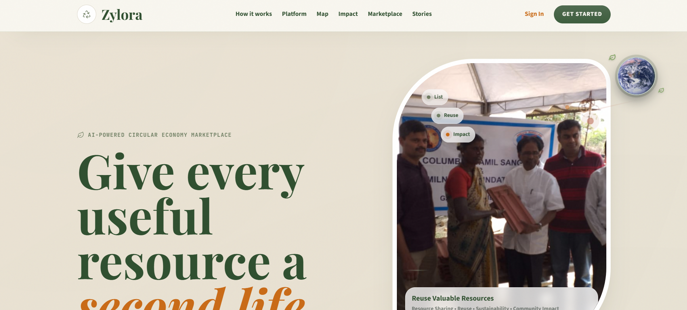
</p>

### Home Experience

<p align="center">
  
</p>

### Authentication

<table>
  <tr>
    <td align="center"><strong>Sign In</strong></td>
    <td align="center"><strong>Sign Up</strong></td>
  </tr>
  <tr>
    <td width="50%">
      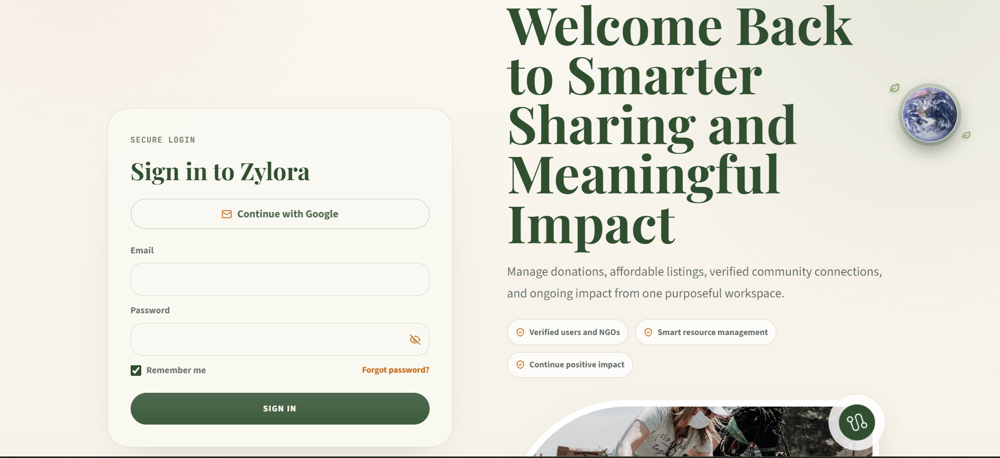
    </td>
    <td width="50%">
      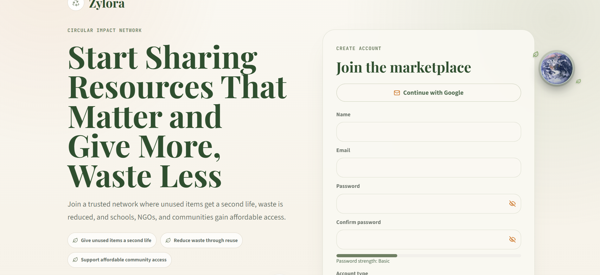
    </td>
  </tr>
</table>

### Marketplace

<p align="center">
  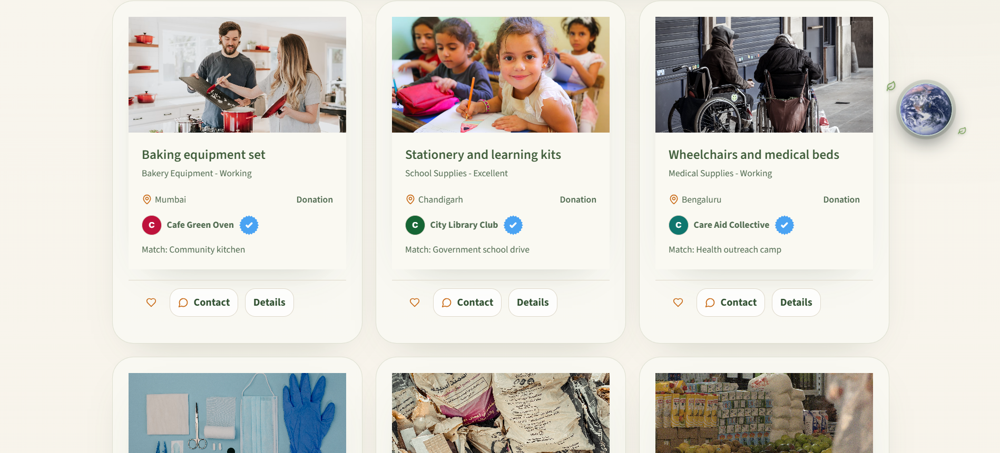
</p>

### Buyer and Seller Dashboards

<table>
  <tr>
    <td align="center"><strong>Buyer Dashboard</strong></td>
    <td align="center"><strong>Seller Dashboard</strong></td>
  </tr>
  <tr>
    <td width="50%">
      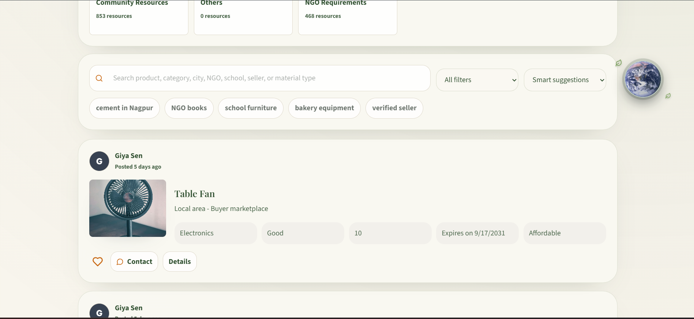
    </td>
    <td width="50%">
      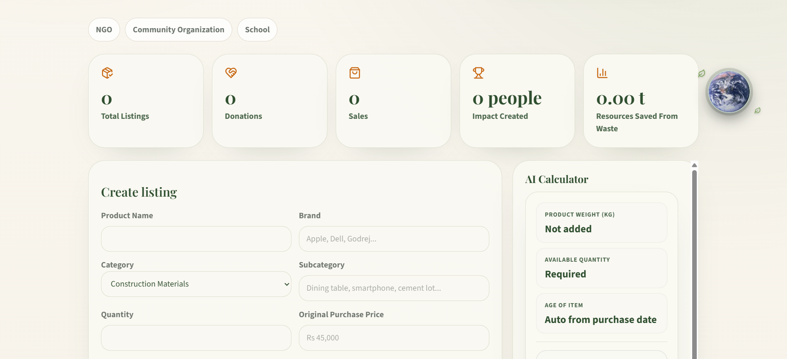
    </td>
  </tr>
</table>

### Donation Experience

<table>
  <tr>
    <td align="center"><strong>Donation Introduction</strong></td>
    <td align="center"><strong>Donate a Resource</strong></td>
  </tr>
  <tr>
    <td width="50%">
      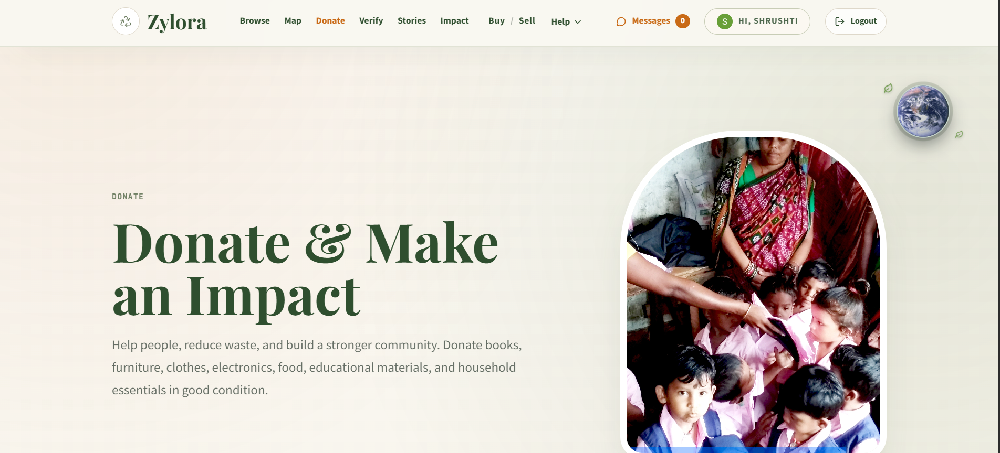
    </td>
    <td width="50%">
      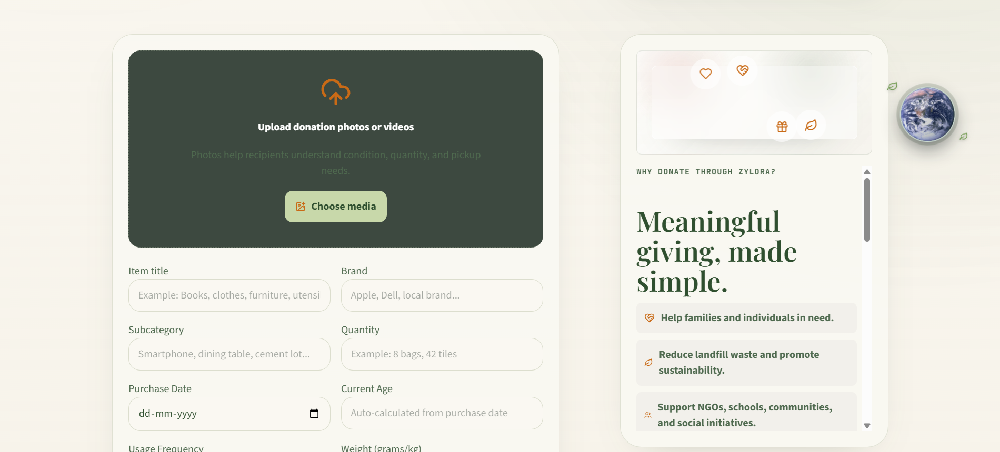
    </td>
  </tr>
</table>

### Resource Map

<p align="center">
  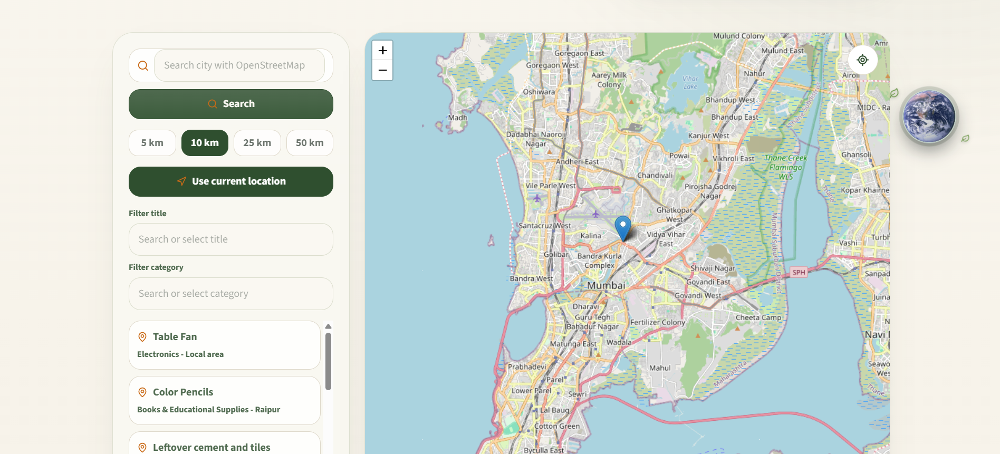
</p>

### Direct Messaging

<p align="center">
  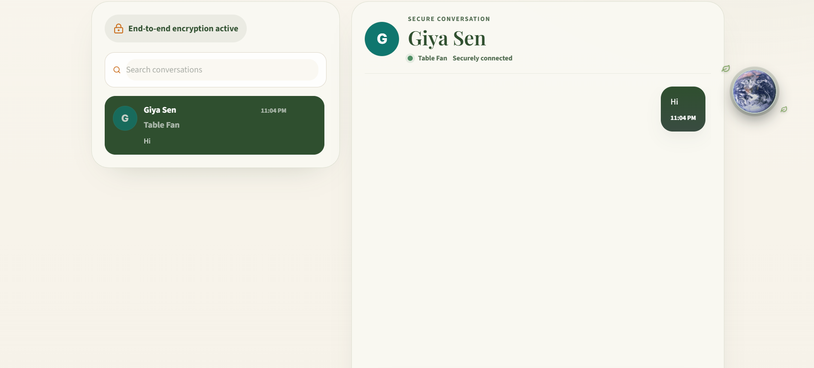
</p>

### Profile and Verification

<table>
  <tr>
    <td align="center"><strong>User Profile</strong></td>
    <td align="center"><strong>Verification</strong></td>
  </tr>
  <tr>
    <td width="50%">
      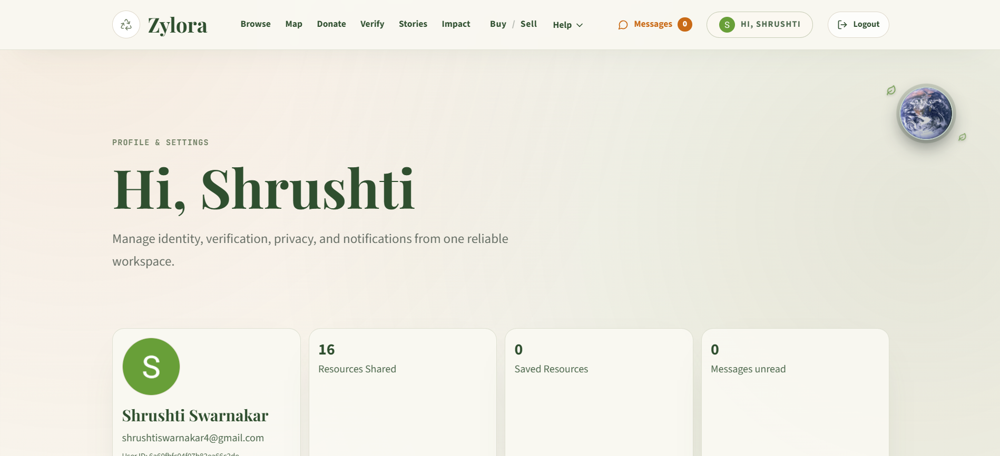
    </td>
    <td width="50%">
      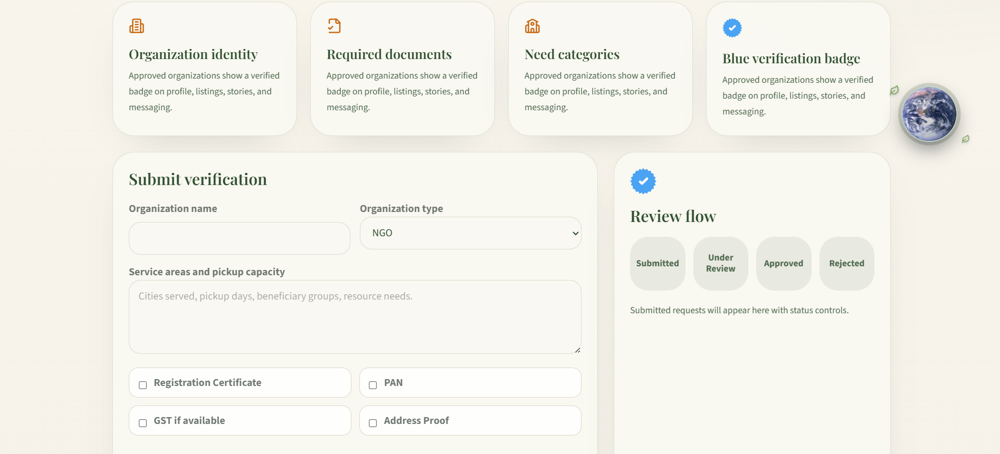
    </td>
  </tr>
</table>

### Success Stories

<p align="center">
  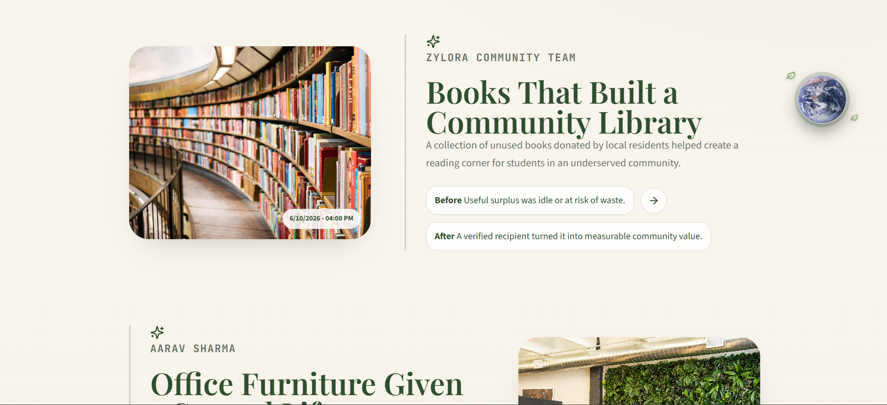
</p>

---

## 🤖 Intelligent Pricing Architecture

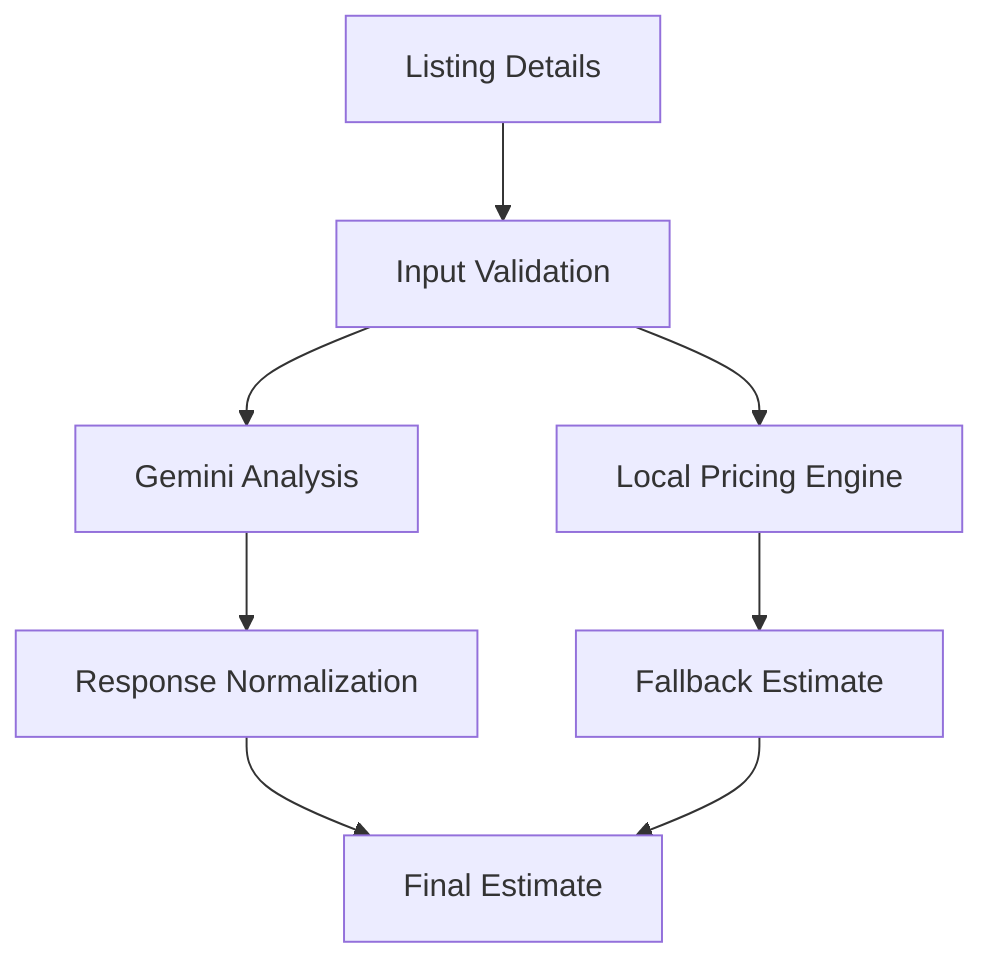

### How Smart Pricing Works

1. The user enters product, category, quantity and condition information.
2. Optional details include age, purchase price, warranty, repair history and damage.
3. Up to four product images can be included in the intelligence request.
4. Input values are validated, normalized and length-limited.
5. The local pricing engine calculates a reliable fallback estimate.
6. If Gemini is configured, it analyzes the product and supporting images.
7. The AI result is normalized into a controlled response structure.
8. If Gemini fails, the local estimate is returned automatically.

### Resale Intelligence

- Fair market value
- Quick-sale value
- Premium listing value
- Negotiation range
- Demand and market trend
- Product condition
- Remaining useful life
- Repair recommendations

### Donation Intelligence

- Estimated beneficiaries
- Social impact
- Community value
- Waste diversion
- Carbon savings
- Resource conservation

---

## 🛠️ Technology Stack

### Frontend

| Technology | Purpose |
|---|---|
| **React 18** | Component-based user interface |
| **TypeScript** | Type-safe frontend development |
| **Vite** | Development server and production build |
| **React Router** | Public and protected routing |
| **Tailwind CSS** | Responsive application styling |
| **Redux Toolkit** | Authentication and theme state |
| **TanStack Query** | API data fetching and caching |
| **Axios** | HTTP communication |
| **Firebase SDK** | Email/password and Google authentication |
| **Leaflet** | Interactive map rendering |
| **React Leaflet** | React integration for Leaflet |
| **Geolib** | Distance and geospatial calculations |
| **Framer Motion** | Interface animations |
| **Zod** | Data validation |
| **Lucide React** | Application icon system |

### Backend

| Technology | Purpose |
|---|---|
| **Node.js 20+** | Backend runtime |
| **Express** | REST API framework |
| **TypeScript** | Type-safe backend development |
| **MongoDB** | Application data persistence |
| **Mongoose** | Database modelling |
| **Firebase Admin** | Firebase token and session verification |
| **Google Gemini** | Optional AI-assisted listing intelligence |
| **Geolib** | Nearby-resource distance calculations |
| **Zod** | Request and environment validation |
| **Helmet** | HTTP security headers |
| **Express Rate Limit** | Endpoint abuse protection |
| **Morgan** | HTTP request logging |
| **Compression** | Response compression |
| **Cookie Parser** | Optional session-cookie handling |

### Intelligence Service

| Technology | Purpose |
|---|---|
| **Python** | Intelligence-service runtime |
| **FastAPI** | Dedicated AI service API |
| **Uvicorn** | ASGI server |
| **Pydantic** | Request and response validation |
| **HTTPX** | External service communication |

### Deployment and Infrastructure

| Tool | Purpose |
|---|---|
| **Vercel** | Frontend deployment |
| **Render** | Express backend deployment |
| **MongoDB Atlas** | Production database |
| **Firebase Authentication** | Managed identity provider |
| **Docker** | Containerized services |
| **Docker Compose** | Local multi-service orchestration |
| **Git and GitHub** | Version control |

---

## 🏗️ System Architecture

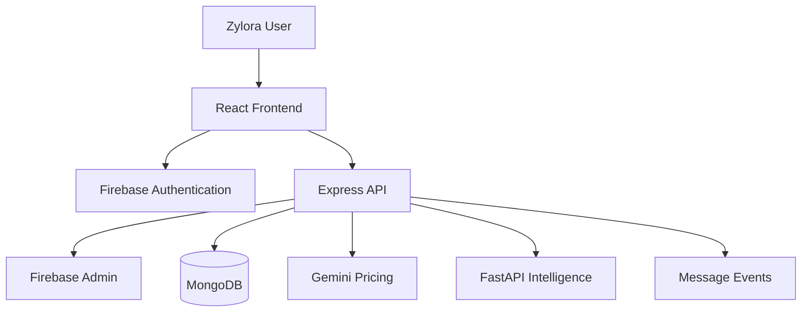

### Application Flow

1. Users authenticate through Firebase.
2. The frontend sends the Firebase ID token to the backend.
3. Firebase Admin verifies the user’s identity.
4. The backend creates or updates the corresponding MongoDB profile.
5. Public marketplace data can be accessed without authentication.
6. Protected operations require verified identity.
7. Listings are stored with ownership and location information.
8. Nearby searches use coordinates and distance calculations.
9. Conversations and profile data are scoped to authenticated users.
10. Pricing requests use the local engine with optional Gemini enhancement.

---

## 👥 Platform Roles

| Role | Primary Experience |
|---|---|
| **Buyer** | Browse, search, save and contact resource owners |
| **Seller** | Create and manage resale listings |
| **Donor** | Publish resources for community reuse |
| **NGO** | Discover donations and coordinate requirements |
| **Business** | Redistribute surplus materials and inventory |
| **Volunteer** | Support community resource coordination |
| **Administrator** | Access protected administrative views |

> Some role experiences share common dashboard components while presenting different actions and content.

---

## 📁 Project Structure

```text
Zylora/
├── api/
│   └── index.js                    # Serverless API entry
│
├── backend/
│   ├── ai-service/
│   │   ├── app/
│   │   │   ├── api/               # FastAPI routes
│   │   │   ├── core/              # Service settings
│   │   │   ├── schemas/           # Pydantic schemas
│   │   │   └── services/          # Intelligence logic
│   │   ├── Dockerfile
│   │   └── requirements.txt
│   │
│   ├── src/
│   │   ├── config/                 # Environment and Firebase Admin
│   │   ├── controllers/            # Auth, resources, users and valuation
│   │   ├── database/               # MongoDB connection
│   │   ├── middleware/             # Auth, security, roles and rate limits
│   │   ├── models/                 # MongoDB application models
│   │   ├── repositories/           # Database access
│   │   ├── routes/                 # REST API routes
│   │   ├── scripts/                # Conversation repair utilities
│   │   ├── services/               # Auth, pricing, valuation and messaging
│   │   ├── types/                  # TypeScript type extensions
│   │   ├── utils/                  # Errors and repair utilities
│   │   ├── app.ts                  # Express application
│   │   └── server.ts               # Backend entry point
│   ├── Dockerfile
│   └── package.json
│
├── frontend/
│   ├── public/                      # Static images, sitemap and manifest
│   ├── src/
│   │   ├── api/                    # Axios client
│   │   ├── app/                    # Application setup
│   │   ├── components/             # Maps, forms and shared components
│   │   ├── config/                 # Firebase configuration
│   │   ├── data/                   # Marketplace and support content
│   │   ├── features/               # Redux feature slices
│   │   ├── hooks/                  # Reusable hooks
│   │   ├── pages/                  # Application pages
│   │   ├── routes/                 # Public and protected routes
│   │   ├── services/               # Auth, listings, users and pricing
│   │   ├── store/                  # Redux store
│   │   ├── styles/                 # Global styling
│   │   ├── types/                  # TypeScript types
│   │   └── utils/                  # Profile and resource utilities
│   └── package.json
│
├── docker/
│   └── docker-compose.yml
│
├── docs/
│   ├── API_DOCUMENTATION.md
│   ├── APP_FLOW.md
│   ├── DATABASE_SCHEMA.md
│   ├── DEPLOYMENT.md
│   ├── PRD.md
│   ├── SECURITY.md
│   ├── SYSTEM_ARCHITECTURE.md
│   ├── TESTING.md
│   └── TRD.md
│
├── screenshots/
├── .env.example
├── LICENSE
├── render.yaml
├── package.json
└── README.md
```

---

## 🚀 Getting Started

### Prerequisites

Install or configure:

- [Node.js](https://nodejs.org/) version 20 or later
- [npm](https://www.npmjs.com/)
- [Git](https://git-scm.com/)
- [MongoDB](https://www.mongodb.com/) or MongoDB Atlas
- [Firebase](https://firebase.google.com/) project
- Python and Docker if running the optional AI service
- Google Gemini API key for enhanced pricing intelligence

### 1. Clone the Repository

```bash
git clone https://github.com/Shrushti2003/Zylora.git
cd Zylora
```

### 2. Install Dependencies

```bash
npm install --workspaces --include-workspace-root
```

### 3. Create the Environment File

#### Git Bash, macOS or Linux

```bash
cp .env.example .env
```

#### Windows Command Prompt

```cmd
copy .env.example .env
```

### 4. Configure Environment Variables

```env
# Application
NODE_ENV=development
PORT=8080
CLIENT_URL=http://localhost:5173
CORS_ORIGIN=http://localhost:5173
API_PUBLIC_URL=http://localhost:8080
VITE_API_BASE_URL=http://localhost:8080/api
VITE_APP_NAME=Zylora
VITE_ENABLE_LOCAL_RESOURCE_SYNC=false

# Database
MONGODB_URI=mongodb://127.0.0.1:27017/zylora

# Firebase Admin — Backend only
FIREBASE_PROJECT_ID=your-firebase-project-id
FIREBASE_CLIENT_EMAIL=your-service-account-email
FIREBASE_PRIVATE_KEY=your-private-key
FIREBASE_SERVICE_ACCOUNT_KEY=

# Firebase Web SDK — Frontend
VITE_FIREBASE_API_KEY=your-firebase-api-key
VITE_FIREBASE_AUTH_DOMAIN=your-project.firebaseapp.com
VITE_FIREBASE_PROJECT_ID=your-firebase-project-id
VITE_FIREBASE_STORAGE_BUCKET=your-project.appspot.com
VITE_FIREBASE_MESSAGING_SENDER_ID=your-sender-id
VITE_FIREBASE_APP_ID=your-app-id

# Optional Gemini intelligence
GOOGLE_GEMINI_API_KEY=your-gemini-api-key

# Optional integrations
OPENAI_API_KEY=
CLOUDINARY_CLOUD_NAME=
CLOUDINARY_API_KEY=
CLOUDINARY_API_SECRET=
RESEND_API_KEY=

# Optional AI service
SERVICE_NAME=zylora-intelligence
SERVICE_VERSION=1.0.0
BACKEND_API_BASE_URL=http://localhost:8080
VECTOR_DATABASE_URL=
```

### 5. Configure Firebase Authentication

In Firebase Console:

1. Open **Authentication → Sign-in method**.
2. Enable **Email/Password**.
3. Enable **Google** authentication.
4. Add the frontend domain under **Authentication → Settings → Authorized domains**.
5. Create a Firebase service account for backend verification.
6. Add the Firebase Web SDK credentials to the frontend environment variables.

For Google sign-in, Firebase manages the callback through:

```text
https://your-project.firebaseapp.com/__/auth/handler
```

### 6. Start the Frontend

```bash
npm run frontend:dev
```

### 7. Start the Backend

Open another terminal:

```bash
npm run backend:dev
```

### 8. Open the Application

| Service | Local URL |
|---|---|
| Frontend | [http://localhost:5173](http://localhost:5173) |
| Backend API | [http://localhost:8080/api](http://localhost:8080/api) |
| Health Check | [http://localhost:8080/api/health](http://localhost:8080/api/health) |

---

## 🐳 Running with Docker

Build and start the configured services:

```bash
docker compose -f docker/docker-compose.yml up --build
```

Stop the services:

```bash
docker compose -f docker/docker-compose.yml down
```

---

## 📜 Available Scripts

| Command | Description |
|---|---|
| `npm run frontend:dev` | Starts the Vite frontend |
| `npm run frontend:build` | Builds the frontend |
| `npm run frontend:lint` | Runs frontend lint checks |
| `npm run backend:dev` | Starts the backend in watch mode |
| `npm run backend:build` | Compiles the TypeScript backend |
| `npm run backend:lint` | Runs backend lint checks |
| `npm run build` | Builds the frontend and backend |
| `npm run lint` | Lints the frontend and backend |

Conversation repair utility:

```bash
npm --prefix backend run repair:conversations
```

---

## 🔌 API Reference

All endpoints use the `/api` prefix.

### Health

| Method | Endpoint | Access | Description |
|---|---|---|---|
| `GET` | `/api/health` | Public | Checks API availability |

### Authentication and Profiles

| Method | Endpoint | Access | Description |
|---|---|---|---|
| `POST` | `/auth/firebase/sync` | Protected | Synchronizes Firebase user with MongoDB |
| `POST` | `/auth/session` | Protected | Creates an optional backend session |
| `POST` | `/auth/logout` | Public | Clears the backend session |
| `POST` | `/auth/account-status` | Public | Checks account/provider status |
| `GET` | `/auth/me` | Protected | Returns the authenticated user |
| `PATCH` | `/auth/profile` | Protected | Updates profile and preferences |
| `POST` | `/auth/saved-resources/:id/toggle` | Protected | Saves or removes a resource |
| `POST` | `/auth/verification` | Protected | Submits user verification |

### Resources

| Method | Endpoint | Access | Description |
|---|---|---|---|
| `GET` | `/resources` | Public | Lists available resources |
| `GET` | `/resources/nearby` | Public | Returns distance-sorted resources |
| `GET` | `/resources/me` | Protected | Returns the current user’s listings |
| `GET` | `/resources/:resourceId` | Public | Returns a resource |
| `POST` | `/resources` | Protected | Creates or synchronizes a listing |
| `DELETE` | `/resources/:resourceId` | Owner | Deletes an owned listing |

Nearby query example:

```text
GET /api/resources/nearby?latitude=19.07&longitude=72.87&radius=10
```

The radius is limited to a maximum of 50 kilometres.

### Public Users

| Method | Endpoint | Access | Description |
|---|---|---|---|
| `GET` | `/users/search?q=query` | Public | Searches visible users |
| `GET` | `/users/:identifier` | Public | Returns a public profile |
| `GET` | `/users/:identifier/posts` | Public | Returns a user’s public listings |

### Messaging

| Method | Endpoint | Access | Description |
|---|---|---|---|
| `GET` | `/auth/messages` | Protected | Lists conversations and unread count |
| `GET` | `/auth/messages/stream` | Protected | Streams message updates |
| `POST` | `/auth/messages/contact` | Protected | Opens a seller conversation |
| `POST` | `/auth/messages/:id` | Protected | Sends a message |
| `POST` | `/auth/messages/:id/read` | Protected | Marks messages as read |
| `POST` | `/auth/messages/:id/upload` | Protected | Uploads an attachment |
| `PATCH` | `/auth/messages/:id/:messageId` | Protected | Edits a message |
| `POST` | `/auth/messages/:id/:messageId/forward` | Protected | Forwards a message |
| `DELETE` | `/auth/messages/:id` | Protected | Deletes selected messages |
| `DELETE` | `/auth/messages/:id/conversation` | Protected | Deletes a conversation |
| `GET` | `/auth/messages/:id/:messageId/attachments/:attachmentId` | Protected | Downloads an attachment |

### Smart Pricing

| Method | Endpoint | Access | Description |
|---|---|---|---|
| `POST` | `/pricing/estimate` | Protected | Returns local or Gemini-enhanced pricing intelligence |

Required pricing fields:

```json
{
  "productName": "Office Chair",
  "category": "Furniture",
  "quantity": "1"
}
```

### Valuations

| Method | Endpoint | Access | Description |
|---|---|---|---|
| `GET` | `/valuations` | Protected | Lists user valuations |
| `POST` | `/valuations` | Protected | Creates a valuation |
| `GET` | `/valuations/analytics` | Protected | Returns valuation analytics |

---

## 🛡️ Security Practices

Zylora includes:

- Firebase-managed password authentication.
- Google authentication through Firebase.
- Backend Firebase ID-token verification.
- Optional HttpOnly backend session cookies.
- Secure production cookies.
- Protected frontend routes.
- Protected backend endpoints.
- Role-protected frontend administrator route.
- Listing-ownership validation.
- Zod request validation.
- Environment validation.
- API-wide rate limiting.
- Additional route-specific rate limits.
- Helmet security headers.
- CORS origin allow-listing.
- Request-body size limits.
- Rejection of unsafe object keys.
- Redacted production request logging.
- Centralized error handling.
- Privacy-aware public profiles.
- Message-attachment validation.
- Environment-based secret handling.

### Current Security Boundaries

- Messaging is not described as end-to-end encrypted.
- Payment processing is currently unavailable.
- The application does not claim formal GDPR, ISO 27001, PCI DSS or DPDP certification.
- Cloud malware scanning should be added before supporting unrestricted production uploads.

---

## 🧪 Testing and Verification

Run all static checks:

```bash
npm run lint
npm run build
```

Run individual checks:

```bash
npm --prefix frontend run lint
npm --prefix frontend run build
npm --prefix backend run lint
npm --prefix backend run build
```

### Manual Regression Areas

- Email/password registration and login.
- Google authentication.
- Password-reset flow.
- Protected-route redirects.
- Create resale listings.
- Create donation listings.
- Delete owned listings.
- Prevent deletion of another user’s listing.
- Marketplace search and filters.
- Nearby map search.
- Save and unsave resources.
- Public profile privacy.
- Contact seller.
- Send, edit, forward and delete messages.
- Upload and download message attachments.
- Unread-message streaming.
- Smart-pricing fallback and Gemini enhancement.
- Profile updates and verification.
- Responsive layouts.
- Help, trust, legal and report pages.

---

## 🚀 Deployment

### Frontend on Vercel

Deploy the `frontend/` application.

Required frontend environment variables:

```env
VITE_API_BASE_URL=https://your-backend-domain.com/api
VITE_APP_NAME=Zylora

VITE_FIREBASE_API_KEY=your-api-key
VITE_FIREBASE_AUTH_DOMAIN=your-project.firebaseapp.com
VITE_FIREBASE_PROJECT_ID=your-project-id
VITE_FIREBASE_STORAGE_BUCKET=your-storage-bucket
VITE_FIREBASE_MESSAGING_SENDER_ID=your-sender-id
VITE_FIREBASE_APP_ID=your-app-id
```

### Backend on Render

The repository includes `render.yaml`.

Required backend variables:

```env
NODE_ENV=production
CLIENT_URL=https://your-frontend-domain.com
CORS_ORIGIN=https://your-frontend-domain.com
API_PUBLIC_URL=https://your-backend-domain.com

MONGODB_URI=your-production-mongodb-uri

FIREBASE_PROJECT_ID=your-project-id
FIREBASE_SERVICE_ACCOUNT_KEY=your-service-account-json

GOOGLE_GEMINI_API_KEY=your-optional-gemini-key
```

Add the deployed frontend domain to Firebase Authorized Domains before testing authentication.

---

## 🚧 Challenges Faced and Solutions

### 1. Synchronizing Firebase and MongoDB Users

**Challenge:** Firebase manages authentication while MongoDB stores platform-specific profiles, roles, preferences and activity.

**Solution:** After Firebase verifies an ID token, the backend creates or updates the corresponding MongoDB user without handling the user’s password directly.

### 2. Supporting Multiple User Roles

**Challenge:** Buyers, sellers, NGOs, businesses, volunteers and administrators need different experiences without duplicating the entire application.

**Solution:** Zylora uses shared platform components with role-oriented routes, dashboards and conditional experiences.

### 3. Building Reliable AI Pricing

**Challenge:** AI providers can fail, return malformed data, or generate unrealistic valuations.

**Solution:** A deterministic local pricing engine always creates a fallback estimate. Gemini results are sanitized and normalized before they replace the fallback.

### 4. Separating Donations from Resale

**Challenge:** Donation resources should communicate social impact rather than displaying irrelevant market prices.

**Solution:** The pricing system uses listing intent and category information to switch between resale estimates and donation-impact analysis.

### 5. Implementing Hyperlocal Discovery

**Challenge:** Nearby resources must be validated and ordered accurately using geographic coordinates.

**Solution:** The API validates latitude, longitude and radius values, then uses geospatial distance calculations to return nearest resources first.

### 6. Designing Real-Time-Feeling Messaging

**Challenge:** Unread counts and conversations must update without constant page refreshes.

**Solution:** The backend exposes a Server-Sent Events stream for message and unread-count updates while standard REST endpoints handle message mutations.

### 7. Protecting User-Owned Resources

**Challenge:** An authenticated user should not be able to delete someone else’s listing.

**Solution:** Resource deletion verifies ownership through the authenticated Firebase identity and stored MongoDB owner ID.

### 8. Maintaining Public Profile Privacy

**Challenge:** Marketplace users need visible profiles, but not every personal field should be public.

**Solution:** Public profile endpoints return privacy-filtered information and respect profile-visibility settings.

### 9. Managing Large Multi-Service Architecture

**Challenge:** The React frontend, Express backend, MongoDB database, Firebase services and optional FastAPI intelligence service must remain independently deployable.

**Solution:** Each service has a clear responsibility, its own configuration, and Docker support for reproducible local orchestration.

---

## 🎓 Key Learnings

Building Zylora strengthened my understanding of:

- Designing technology around circular-economy workflows.
- Building full-stack applications with React and TypeScript.
- Creating REST APIs using Express and layered backend architecture.
- Integrating Firebase Authentication with a custom backend.
- Verifying Firebase tokens through Firebase Admin.
- Synchronizing managed identities with MongoDB profiles.
- Designing role-oriented user experiences.
- Building reusable marketplace and dashboard components.
- Implementing geospatial search and distance sorting.
- Creating interactive maps using Leaflet.
- Designing direct-message APIs and SSE update streams.
- Enforcing resource ownership.
- Building deterministic fallbacks for AI-dependent features.
- Normalizing AI-generated structured data.
- Separating resale value from donation impact.
- Implementing privacy-aware public profiles.
- Securing APIs through validation, rate limiting, CORS and headers.
- Coordinating Node.js and Python services.
- Deploying frontend and backend applications separately.
- Documenting security boundaries honestly.

---

## 🔮 Future Improvements

Potential future enhancements include:

- [ ] Add secure payment and escrow support.
- [ ] Add order and transaction management.
- [ ] Add real-time WebSocket messaging.
- [ ] Add end-to-end message encryption.
- [ ] Integrate production cloud media storage.
- [ ] Add malware scanning for uploaded files.
- [ ] Add automatic image moderation.
- [ ] Add delivery and volunteer logistics tracking.
- [ ] Add live route optimization.
- [ ] Add organization-member management.
- [ ] Add team dashboards for NGOs and businesses.
- [ ] Add advanced sustainability reporting.
- [ ] Add verified impact certificates.
- [ ] Add listing reviews and reputation scores.
- [ ] Add shared-resource reservation workflows.
- [ ] Add multilingual marketplace support.
- [ ] Add push and email notifications.
- [ ] Add automated unit, integration and end-to-end tests.
- [ ] Add GitHub Actions for build and security checks.
- [ ] Add production monitoring and audit logs.
- [ ] Add OpenAPI and Swagger documentation.

---

## ❓ Frequently Asked Questions

<details>
<summary><strong>What is Zylora?</strong></summary>

Zylora is a circular-economy marketplace where users can sell, donate, discover and request reusable resources while connecting with nearby community members and organizations.

</details>

<details>
<summary><strong>Who can use the platform?</strong></summary>

The platform provides experiences for buyers, sellers, individual donors, NGOs, businesses, volunteers and administrators.

</details>

<details>
<summary><strong>How does authentication work?</strong></summary>

Firebase handles email/password and Google authentication. The Express backend verifies Firebase tokens before allowing protected actions and synchronizes verified users with MongoDB.

</details>

<details>
<summary><strong>How does smart pricing work?</strong></summary>

Zylora uses a local pricing engine to create a reliable estimate. When Gemini is configured, AI analysis can enhance the result using product details, condition and selected images.

</details>

<details>
<summary><strong>What happens if Gemini is unavailable?</strong></summary>

The platform automatically returns the deterministic local estimate instead of failing the complete listing workflow.

</details>

<details>
<summary><strong>Does Zylora charge for donations?</strong></summary>

Donation listings are designed around social and environmental impact rather than resale pricing. Payment processing is not currently implemented.

</details>

<details>
<summary><strong>How are nearby resources found?</strong></summary>

The nearby-resource API validates the user’s coordinates and search radius, calculates the distance to listings, and returns them ordered by proximity.

</details>

<details>
<summary><strong>Can users contact resource owners?</strong></summary>

Yes. Authenticated users can open conversations from listing context and exchange messages through the platform.

</details>

<details>
<summary><strong>Is messaging end-to-end encrypted?</strong></summary>

No. The current implementation does not claim end-to-end encryption. This is listed as a future security improvement.

</details>

---

## 🤝 Contributing

Contributions and improvement suggestions are welcome.

1. Fork the repository.
2. Create a feature branch:

```bash
git checkout -b feature/your-feature-name
```

3. Make and test your changes.
4. Commit the changes:

```bash
git commit -m "Add: description of your feature"
```

5. Push your branch:

```bash
git push origin feature/your-feature-name
```

6. Open a pull request with a clear explanation of the change.

---

## 📄 License

Zylora is available under the [MIT License](LICENSE).

```text
Copyright © 2026 Zylora
```

You may use, modify and distribute the software according to the terms of the MIT License.

---

## 👩‍💻 Developer

<div align="center">

### Shrushti Swarnakar

Full-stack developer focused on creating intelligent, scalable and socially meaningful web applications.

[](https://github.com/Shrushti2003)
[](https://www.linkedin.com/in/shrushti-swarnakar/)
[](https://leetcode.com/u/Shrushti2003/)

</div>

---

## ⭐ Support

If Zylora’s mission or engineering interests you:

- Give the repository a **star**.
- Share it with developers and sustainability communities.
- Submit ideas through GitHub issues.
- Connect with the developer on LinkedIn.

<div align="center">

### Reuse more. Waste less. Create lasting impact.

**[Explore Zylora →](https://zylora-frontend.vercel.app)**

</div>
